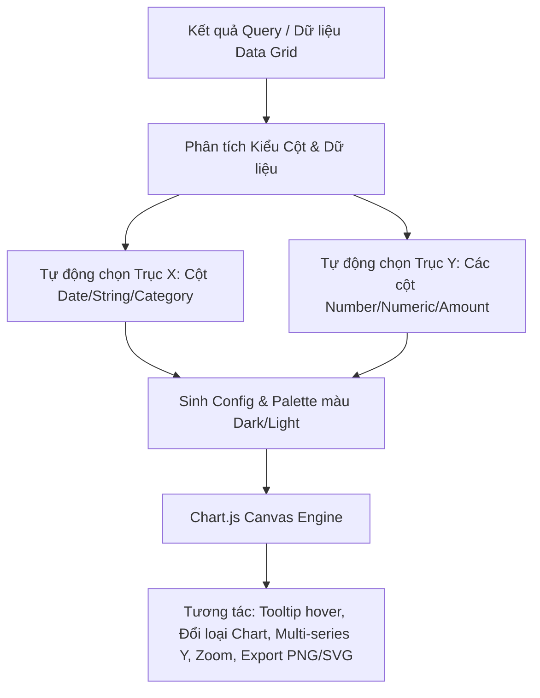

# Thiết kế & Kế hoạch Triển khai: Visual Chart & BI Lite (Sử dụng Chart.js)

> **Mục tiêu:** Bổ sung nút chuyển đổi nhanh giữa chế độ xem **Bảng dữ liệu (Data Grid)** và **Biểu đồ trực quan (Visual Chart)** ngay trong `SqlEditor` (Result Pane) và `DataGrid` (Table Data View). Giúp người dùng quan sát xu hướng, so sánh chỉ số, vẽ báo cáo nhanh mà không cần export ra Excel hay cài đặt Metabase/Superset.
>
> 🚀 **Công nghệ lựa chọn:** **Chart.js (`chart.js`)** — Động cơ Canvas siêu nhẹ (~60KB), hiệu năng cao, tương thích 100% React 19 + Tauri v2, hỗ trợ đầy đủ Tree-shaking và xuất ảnh PNG/SVG tức thì.

---

## 1. Các Loại Biểu Đồ Hỗ Trợ (Supported Chart Types)

| Loại Biểu đồ | Biểu tượng | Trường hợp sử dụng tối ưu |
| :--- | :---: | :--- |
| **Bar Chart (Cột đứng)** | 📊 | So sánh doanh số, số lượng giữa các danh mục, phòng ban, sản phẩm. |
| **Horizontal Bar (Cột ngang)**| 📶 | Phù hợp khi nhãn trục X có tên dài (Top 10 khách hàng, URL, tên sách). |
| **Line Chart (Đường xu hướng)**| 📈 | Theo dõi biến động theo thời gian (Doanh thu theo ngày/tháng, lượng user mới) với đường cong mượt mà. |
| **Area Chart (Miền tích lũy)** | 📉 | Thể hiện tổng thể và phần đóng góp theo thời gian với gradient màu HSL hiện đại. |
| **Pie / Donut Chart (Tròn/Bánh)**| 🥧 | Thể hiện tỷ lệ phần trăm (Thị phần, trạng thái đơn hàng: Done/Pending/Cancel). |
| **Scatter Plot (Phân tán)** | ⚬ | So sánh tương quan giữa 2 chỉ số số học (Giá bán vs Số lượng mua). |

---

## 2. Kiến trúc Kỹ thuật & Tự động Nhận diện Trục (Auto Schema Inference)

### 2.1. Động cơ Chart.js Canvas (Tối ưu cho Desktop & React 19)
* **Siêu nhẹ (~60 KB):** Sử dụng Tree-shaking từ `chart.js` (chỉ đăng ký các module cần thiết như `CategoryScale`, `LinearScale`, `BarElement`, `PointElement`, `LineElement`, `ArcElement`, `Tooltip`, `Legend`, `Filler`).
* **Hiệu năng Canvas cao:** Khả năng vẽ mượt mà hàng ngàn điểm dữ liệu với animation mượt và tiêu thụ CPU/RAM cực thấp.
* **Tự động thích ứng giao diện (Theme Adaptive):** Bảng màu HSL hài hòa tự động điều chỉnh theo Theme Dark / Light của TableNova (màu chữ, đường lưới gridlines, màu nền popover tooltip).

### 2.2. Trí thông minh Nhận diện Cột (Smart Column Binding)
1. **Trục X (Dimension / Category):**
   * Ưu tiên cột thời gian (`date`, `created_at`, `month`, `year`) -> Tự động cấu hình Line/Area chart.
   * Cột text danh mục (`status`, `country`, `category_name`, `name`) -> Tự động cấu hình Bar/Pie chart.
2. **Trục Y (Metrics / Measures):**
   * Lọc tất cả các cột kiểu số (`int`, `float`, `decimal`, `total`, `amount`, `count`, `price`).
   * Hỗ trợ chọn **nhiều cột Y cùng lúc (Multi-series)** để so sánh trực tiếp (ví dụ: `Doanh thu` vs `Chi phí` vs `Lợi nhuận`).
3. **Chế độ Tổng hợp (Aggregation):**
   * Hỗ trợ gom nhóm dữ liệu theo X với các hàm: `SUM`, `COUNT`, `AVG`, `MIN`, `MAX`, hoặc vẽ trực tiếp từng dòng (`Raw`).

---

## 3. Trải nghiệm Giao diện Người dùng (UI / UX Flow)

### 3.1. Nút chuyển đổi chế độ xem (View Switcher)
* Trên thanh công cụ kết quả của `SqlEditor` và `DataGrid`, bổ sung nhóm nút Segmented Control:
  * 🗂️ **Grid View (Bảng dữ liệu)**
  * 📊 **Chart View (Biểu đồ trực quan)**
  * ℹ️ **Structure / Explain (nếu có)**

### 3.2. Bảng điều khiển cấu hình Biểu đồ (Sidebar / Toolbar Settings)
* **Thanh công cụ nhanh phía trên:**
  * Chọn loại Chart (Bar, Horizontal Bar, Line, Area, Pie, Donut).
  * Dropdown chọn cột **Trục X (Dimension)**.
  * Dropdown/Multi-select chọn **Trục Y (Measures / Values)**.
  * Dropdown chọn hàm Gom nhóm: `None (Raw)`, `SUM`, `AVG`, `COUNT`.
  * Sắp xếp: Sắp xếp theo X (A-Z, Thời gian) hoặc theo Y (Giảm dần, Tăng dần).
* **Nút tiện ích góc phải:**
  * 📸 **Xuất ảnh PNG / Vector SVG** (`chart.toBase64Image()`).
  * 📋 **Sao chép ảnh vào Clipboard** (Copy image).
  * 🎛️ **Ẩn/Hiện Chú thích (Legend) & Đường lưới (Gridlines)**.

---

## 4. Danh sách các File cần Triển khai

Tuân thủ nghiêm ngặt **AGENTS.md**: CSS Classes định nghĩa trong `src/index.css`.

### 4.1. Cài đặt Dependency
* Cài đặt gói gọn nhẹ: `npm install chart.js`

### 4.2. Động cơ & Tiện ích Tính toán Biểu đồ
* **[NEW] `src/utils/chartDataEngine.ts`**:
  * Tự động nhận diện cột Dimension (X) và Metrics (Y).
  * Hàm tính toán gom nhóm (GroupBy + Aggregation).
  * Bảng màu phối sắc hiện đại (HSL Tailored Palettes) thích ứng Dark/Light theme.
* **[NEW] `src/utils/chartSetup.ts`**:
  * Đăng ký Tree-shaking các Controllers, Elements, Plugins và Scales của Chart.js.

### 4.3. Giao diện Biểu đồ
* **[NEW] `src/components/chart/DataVisualizer.tsx`**:
  * Component chính tích hợp Toolbar + Canvas Chart + Legend + Export buttons.
* **[NEW] `src/components/chart/ChartToolbar.tsx`**:
  * Thanh công cụ chọn loại biểu đồ, trục X, trục Y, Aggregation và nút Export/Copy.

### 4.4. Tích hợp vào DataGrid & SqlEditor
* **[MODIFY] `src/components/SqlEditor.tsx`**:
  * Thêm nút chuyển `Grid / Chart` vào thanh action bar của Pane 1 và Pane 2.
  * Render `DataVisualizer` khi người dùng chọn tab Chart.
* **[MODIFY] `src/components/DataGrid.tsx`**:
  * Thêm nút chuyển đổi chế độ xem `Table / Structure / Chart` ở thanh header.
* **[MODIFY] `src/index.css`**:
  * Thêm các CSS classes cho `.chart-visualizer-container`, `.chart-toolbar`, `.chart-segmented-btn`, `.chart-legend-item`.

---

## 5. Kế hoạch Kiểm thử & Xác minh

1. **Kiểm tra Tự động Nhận diện:**
   * Chạy query `SELECT department, SUM(salary) as total_salary FROM employees GROUP BY department;` -> Tự động nhận diện X=`department`, Y=`total_salary`, vẽ Bar chart ngay lập tức.
   * Chạy query theo ngày tháng `SELECT order_date, total_amount FROM orders;` -> Tự động gợi ý Line/Area chart.
2. **Kiểm tra Chuyển đổi Biểu đồ & Nhiều Series:**
   * Chuyển đổi qua lại giữa Bar 📊, Line 📈, Pie 🥧, Donut 🍩 mượt mà.
   * Chọn 2-3 cột Y cùng lúc trên Line chart -> Các đường vẽ hiển thị với màu sắc tách biệt và legend tương ứng.
3. **Kiểm tra Xuất File & Clipboard:**
   * Bấm "Xuất ảnh PNG" -> File ảnh tải về sắc nét.
   * Bấm "Copy ảnh" -> Dán trực tiếp vào ứng dụng chat (Slack, Zalo, Teams).
4. **Kiểm tra Hiệu năng & Theme:**
   * Dữ liệu hàng nghìn dòng render mượt mà, tooltip phản hồi tức thì.
   * Màu sắc biểu đồ đồng bộ hoàn hảo với Dark Mode và Light Mode.
