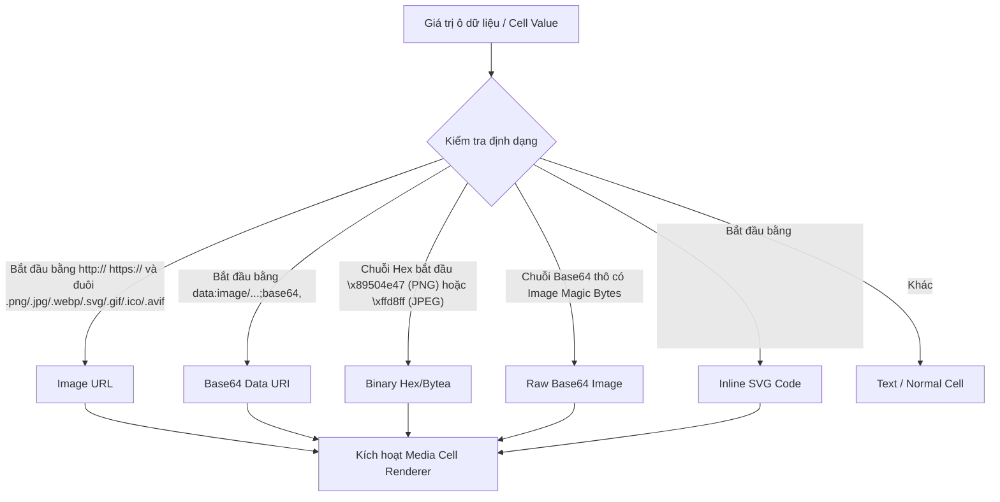

# Thiết kế & Kế hoạch Triển khai: Media / Image Viewer (Preview ảnh Base64, URL, Blob)

> **Mục tiêu:** Cho phép xem trước (preview) hình ảnh và dữ liệu media trực tiếp ngay trên ô dữ liệu (DataGrid & SQL Query Results) khi di chuột (hover) hoặc phóng to xem chi tiết trong modal lightbox khi click/mở rộng cell.

---

## 1. Các định dạng & Nguồn dữ liệu Media được nhận diện (Detection Engine)

Hệ thống sẽ tự động phân tích và nhận diện định dạng media từ giá trị của cell:

1. **Image URLs:** `http://...`, `https://...` trỏ tới file ảnh (.png, .jpg, .jpeg, .webp, .svg, .gif, .avif, .ico).
2. **Base64 Data URIs:** `data:image/png;base64,iVBORw0KGgo...`
3. **Raw Base64 Strings:** Chuỗi base64 thô tự động được convert thành Data URI khi phát hiện magic bytes (`iVBORw0...` cho PNG, `/9j/...` cho JPEG, `R0lGOD...` cho GIF).
4. **Binary Hex / Database Bytea / BLOBs:** Chuỗi byte dạng hex (ví dụ Postgres `\x89504e47...` hoặc SQLite/MySQL BLOB hex) được chuyển đổi sang Base64 Data URL để hiển thị.
5. **Raw SVG Text:** Mã nguồn vector SVG chuẩn XML (`<svg xmlns="...">`).

---

## 2. Trải nghiệm Người dùng (UX / UI Specifications)

### 2.1. Hiển thị gọn trong Ô (Inline Cell Preview)
* Thay vì hiển thị chuỗi Base64 dài ngoằng làm vỡ layout, cell sẽ hiển thị:
  * Một **thumbnail nhỏ** (20x20px) có bo góc nhẹ.
  * Kèm nhãn định dạng ngắn (ví dụ: `[PNG 128KB]` hoặc `[URL] image.png`).
  * Nền checkerboard (caro mờ) hỗ trợ tốt cho ảnh trong suốt (transparent PNG/SVG).

### 2.2. Xem nhanh khi Hover (Hover Popover / Tooltip)
* Khi rê chuột vào thumbnail / cell:
  * Hiển thị Popover nổi với hình ảnh kích thước vừa phải (max 280x280px).
  * Hiển thị metadata: **Kích thước ảnh thực tế (Width x Height)**, **Dung lượng file**, và **MIME Type**.
  * Animation mượt mà, tự động căn chỉnh vị trí tránh tràn ra ngoài màn hình.

### 2.3. Modal Xem chi tiết & Thao tác (Media Lightbox Modal)
* Khi click vào thumbnail hoặc chọn "Xem ảnh chi tiết" từ Context Menu:
  * Mở **MediaViewerModal** toàn màn hình / kích thước lớn.
  * **Công cụ tương tác:**
    * 🔍 **Zoom In / Zoom Out / Reset Zoom (100%, Fit)**
    * 🔄 **Xoay ảnh (Rotate 90°, 180°, 270°)**
    * 📋 **Sao chép:** Copy Image to Clipboard, Copy URL, Copy Base64 text.
    * 💾 **Tải về (Download):** Lưu ảnh trực tiếp về máy tính dưới định dạng gốc.
    * 🌗 **Đổi màu nền:** Chuyển đổi nền caro tối / caro sáng / đen / trắng để kiểm tra độ tương phản của ảnh.

---

## 3. Kiến trúc Module & Danh sách File cần Triển khai

Tuân thủ nghiêm ngặt **AGENTS.md**: Không dùng inline CSS (ngoại trừ tọa độ chuột hoặc kích thước zoom động), tất cả styling được định nghĩa bằng class trong `src/index.css`.

### 3.1. Utility nhận diện Media & Chuyển đổi Binary
* **[NEW] `src/utils/mediaDetector.ts`**:
  * `detectMediaType(val: any): MediaInfo | null`
  * `convertBlobToDataUrl(hexOrBase64: string): string`
  * `parseImageDimensions(dataUrl: string): Promise<{ width: number; height: number }>`

### 3.2. Components Giao diện
* **[NEW] `src/components/media/MediaCellPreview.tsx`**:
  * Render thumbnail nhỏ trong cell kèm hover popover.
* **[NEW] `src/components/media/MediaViewerModal.tsx`**:
  * Modal lightbox phóng to, zoom/pan, xoay, download, copy.
* **[NEW] `src/components/media/MediaHoverPopover.tsx`**:
  * Popover xem nhanh khi rê chuột qua ô.

### 3.3. Tích hợp vào các Grid hiện có
* **[MODIFY] `src/components/DataGrid.tsx`**:
  * Tích hợp `MediaCellPreview` vào hàm render cell bảng dữ liệu.
  * Thêm tùy chọn "Xem ảnh chi tiết" vào Context Menu.
* **[MODIFY] `src/components/SqlEditor.tsx`**:
  * Tích hợp `MediaCellPreview` vào Result Grid của Pane 1 và Pane 2.
* **[MODIFY] `src/components/RowDocumentModal.tsx`**:
  * Hiển thị preview trực quan trong tab Table/Tree/Document viewer.

### 3.4. CSS Styling
* **[MODIFY] `src/index.css`**:
  * Thêm CSS classes cho:
    * `.media-cell-thumbnail`
    * `.media-hover-popover`
    * `.media-checkerboard-bg`
    * `.media-viewer-modal`
    * `.media-toolbar-btn`

---

## 4. Kế hoạch Kiểm thử & Xác minh

1. **Kiểm tra Nhận diện:**
   * Cell chứa URL `https://.../avatar.jpg` -> Hiển thị thumbnail và preview khi hover.
   * Cell chứa Base64 `data:image/png;base64,...` -> Render ảnh chuẩn xác.
   * Cell chứa Postgres `bytea` dạng `\x89504e...` -> Tự động decode và hiển thị ảnh.
2. **Kiểm tra Tương tác:**
   * Hover vào ô -> Hiện popover nhanh kèm kích thước Width x Height.
   * Click vào ô -> Mở modal lightbox; thử nghiệm zoom, xoay 90 độ, đổi màu nền.
   * Bấm "Sao chép ảnh" / "Tải về" -> Ảnh được lưu vào clipboard hoặc lưu file thành công.
3. **Kiểm tra Hiệu năng & Quy tắc CSS:**
   * Grid render 100 dòng chứa ảnh không bị đơ giật (sử dụng lazy load / memo thumbnail).
   * Kiểm tra không có Inline CSS vi phạm quy tắc `AGENTS.md`.
