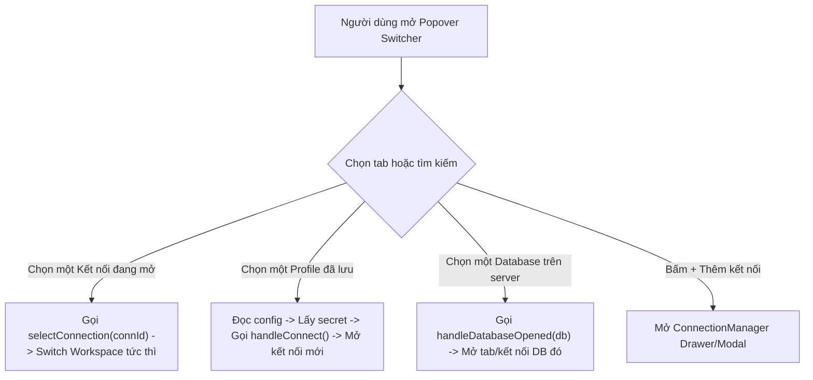

# Kế hoạch Thiết kế & Triển khai: Quick Switcher Chuyển đổi Kết nối & Database trực tiếp

Tài liệu này nghiên cứu và đề xuất kiến trúc UX/UI cùng giải pháp kỹ thuật để người dùng có thể **chuyển đổi nhanh giữa các Kết nối (Connection Profiles) và Databases** ngay trong popup switcher trên thanh tiêu đề (TitleBar) mà không cần phải quay lại màn hình Connection Manager.

---

## 1. Hiện trạng & Vấn đề

- **Hiện tại**: Popup này (`TitleBar.tsx ➔ showDbPopover`) chỉ hiển thị danh sách các **Databases trên máy chủ hiện tại** (`filteredDbList`).
- **Nhu cầu**: Người dùng muốn có thể chuyển đổi sang một **Kết nối khác** (Saved Connection Profile hoặc Live Open Connection) ngay tại đây, giống như các công cụ chuyên nghiệp (DataGrip / TablePlus / Raycast).

---

## 2. Đề xuất Kiến trúc UX/UI

Có 2 phương án thiết kế tối ưu, trong đó **Phương án 1 (Segmented Tabs)** là phương án được khuyến nghị nhất vì độ rõ ràng và trực quan:

### 🌟 Phương án 1 (Khuyên dùng): Segmented Switcher (2 Tab riêng biệt: Kết nối & Databases)

Popup có 2 tab chuyển đổi ở đầu:
- **Tab 1: 🔌 Kết nối (Connections)**
  - **Mục "Đang mở" (Active/Open Connections)**: Hiện các kết nối đang chạy (có icon dialect, nhãn màu, số transaction chưa commit). Nhấn vào là switch workspace ngay lập tức.
  - **Mục "Đã lưu" (Saved Profiles)**: Danh sách các profile kết nối đã lưu trong máy (MySQL local, Staging Postgres, SQLite demo, Redis...). Nhấn vào sẽ tự động lấy thông tin xác thực từ Keychain và mở kết nối mới.
  - **Nút "+ Thêm kết nối mới"**: Mở modal kết nối nhanh.
- **Tab 2: 🗄️ Databases (Trên máy chủ hiện tại)**
  - Giữ nguyên danh sách Databases hiện tại với ô filter, nút tạo database và thống kê.

```
┌──────────────────────────────────────────────┐
│  [  🔌 Kết nối (4)  ]   [  🗄️ Databases (8)  ]│  <-- Tab chuyển đổi
├──────────────────────────────────────────────┤
│  🔍 Tìm kết nối hoặc máy chủ...              │
├──────────────────────────────────────────────┤
│  KẾT NỐI ĐANG MỞ (2)                         │
│  ✔ 🐬 Local MySQL (test)          [Active]   │
│    🐘 Staging PostgreSQL (main)              │
│                                              │
│  KẾT NỐI ĐÃ LƯU (3)                          │
│    📦 Production SQLite                      │
│    🔴 Redis Cache Server                     │
│    🐬 Dev Server MySQL                       │
├──────────────────────────────────────────────┤
│  ➕ Thêm kết nối mới...                       │
└──────────────────────────────────────────────┘
```

---

### 🌟 Phương án 2: Unified Command Palette (Gộp chung trong 1 danh sách phân nhóm)

- Không chia tab, dùng 1 ô tìm kiếm thông minh duy nhất (`🔍 Tìm kết nối hoặc database...`).
- Danh sách bên dưới tự động lọc và gom nhóm:
  - Nhóm 1: `KẾT NỐI ĐANG MỞ`
  - Nhóm 2: `KẾT NỐI ĐÃ LƯU`
  - Nhóm 3: `DATABASES TRÊN MÁY CHỦ NÀY`

---

## 3. Kiến trúc Kỹ thuật (Technical Implementation)

### 3.1. Nguồn dữ liệu
1. **Kết nối đang mở**: Lấy từ `openConns` (trong `App.tsx`) hoặc `dbHelper.listConnections()`.
2. **Profile kết nối đã lưu**: Đọc từ `localStorage.getItem('tf_connection_profiles')`.
3. **Mật khẩu / Khóa bí mật**: Đã được lưu trữ an toàn trong kho bảo mật HĐH (`secret_store`). Khi người dùng chọn kết nối từ danh sách đã lưu, gọi `secret_get_many` để giải mã mật khẩu rồi gọi `dbHelper.connect()`.
4. **Databases hiện tại**: Giữ nguyên cơ chế gọi `dbHelper.listDatabases()`.

### 3.2. Luồng hoạt động (Control Flow)


### 3.3. Các tệp cần chỉnh sửa khi thực hiện

#### 1. [NEW] `src/components/QuickSwitcherPopover.tsx`
- Tách riêng toàn bộ logic popup từ `TitleBar.tsx` thành một component độc lập, sạch sẽ và dễ bảo trì.
- Chứa logic hiển thị 2 tab (Connections & Databases), ô tìm kiếm và các nút thao tác nhanh.

#### 2. [MODIFY] [src/components/TitleBar.tsx](file:///c:/workspace/table/src/components/TitleBar.tsx)
- Nhúng `QuickSwitcherPopover` thay cho phần popup code inline hiện tại.
- Truyền danh sách `openConns`, hàm `onSelectConnection`, `onConnectSavedProfile`, `onNewConnection`.

#### 3. [MODIFY] [src/App.tsx](file:///c:/workspace/table/src/App.tsx)
- Cung cấp handler kết nối nhanh từ profile đã lưu: `handleConnectSavedProfile(profile)`.

#### 4. [MODIFY] [src/index.css](file:///c:/workspace/table/src/index.css)
- Thêm CSS classes cho tab switcher, connection item cards, tag badges và hiệu ứng transition.

---

## 4. Kế hoạch xác minh (Verification Plan)

### Kiểm thử thủ công:
1. Mở popup từ nút Database trên TitleBar.
2. Kiểm tra chuyển qua lại giữa Tab **Kết nối** và Tab **Databases**.
3. Bấm vào một kết nối đang mở khác ➔ Xác nhận workspace đổi sang kết nối đó ngay lập tức.
4. Bấm vào một profile đã lưu (chưa mở) ➔ Xác nhận app tự động kết nối và mở thêm kết nối mới vào DbRail/Workspace.
5. Bấm vào một Database trong danh sách ➔ Xác nhận mở database bình thường.
