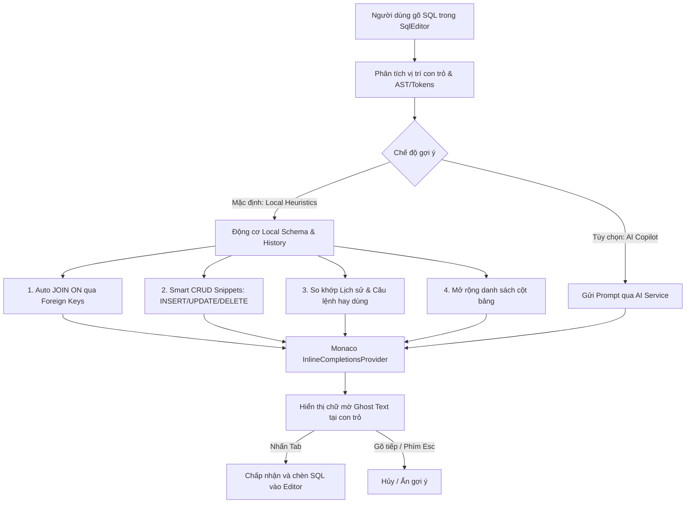

# Thiết kế & Kế hoạch Triển khai: Gợi ý SQL Trực tiếp dạng Ghost Text (Local Heuristics & Hybrid Engine)

> **Mục tiêu:** Bổ sung tính năng gợi ý câu lệnh SQL thông minh hiển thị dưới dạng **chữ mờ (Ghost Text)** ngay khi người dùng đang soạn thảo trong `SqlEditor`. Người dùng chỉ cần nhấn phím `Tab` để nhận gợi ý (tương tự trải nghiệm GitHub Copilot / Cursor).
>
> 🌟 **Điểm đặc biệt:** **100% Offline & Không cần bất kỳ Model AI nào** (sử dụng động cơ Local Schema Heuristics & History Matching với độ trễ 0ms). Đồng thời hỗ trợ chế độ **Hybrid** (tùy chọn nâng cao với AI nếu người dùng muốn).

---

## 1. Bối cảnh & Vị thế của TableNova

### 1.1. Xu hướng Database GUI hiện nay
* **Gọn nhẹ & Native:** Chuyển dịch từ Java/Heavy Electron sang Tauri/Rust (khởi động tức thì, tiêu thụ ít RAM, render virtual grid mượt mà).
* **Trải nghiệm No-Code / Spreadsheet-like:** Sửa dữ liệu trực tiếp (in-place), staging changes review trước khi commit.
* **Inline Auto-completion (Ghost Text):** Gợi ý cú pháp, cấu trúc bảng, quan hệ Foreign Keys và lịch sử ngay tại vị trí con trỏ.
* **Bảo mật & Production Guard:** Safe Mode, cảnh báo truy vấn nguy hiểm không có WHERE.
* **Đa cơ sở dữ liệu:** RDBMS (PostgreSQL, MySQL, SQLite) kết hợp In-Memory Cache (Redis).

### 1.2. Hiện trạng của TableNova
* **Đã đáp ứng rất tốt (~85%):**
  * Nền tảng **Tauri v2 + Rust + React** tối ưu hiệu năng.
  * Bộ công cụ **Redis** chuyên sâu (Pub/Sub, Stream, Profiler, Slow Log, Keyspace Transfer, Terminal).
  * Trực quan hóa **Visual Query Plan (EXPLAIN)** đa dạng (Diagram, Grid, Tree, Stats).
  * **Safe Mode & Transaction Control** (TxControl).
  * **Database Compare & Mock Data Generator**.
  * **AI Assistant & MCP Server** tích hợp.
* **Mảnh ghép nâng cấp trọng tâm:**
  * **Ghost Text Inline Completion (Local Heuristic First + Optional AI)** trực tiếp trong Monaco SQL Editor.
  * Visual ERD Diagram tương tác kéo thả.
  * Chart visualization nhanh từ kết quả query.

---

## 2. Kiến trúc Kỹ thuật Động cơ Ghost Text (Local First)

---

## 3. Các Quy tắc Động cơ Local (Heuristic Rules - 0ms Latency)

### 3.1. Tự động hoàn thành mệnh đề JOIN (Smart Auto-JOIN)
* **Kích hoạt:** Khi người dùng vừa gõ xong `... JOIN <table_name> ` hoặc `... JOIN <table_name> ON `.
* **Xử lý:**
  * Trích xuất các bảng trước đó trong câu query (sử dụng `collectTableRefs` từ `src/sql/statements.ts`).
  * Tìm kiếm trong `catalog.ts` và `joinConditions.ts` xem có quan hệ Foreign Key giữa bảng mới và các bảng trước đó hay không.
* **Ghost text hiển thị:** `ON <source_table>.<fk_col> = <target_table>.<pk_col>`
* **Ví dụ:**
  * Gõ: `SELECT * FROM orders JOIN users `
  * Ghost text: `ON orders.user_id = users.id`

### 3.2. Mẫu câu lệnh CRUD Thông minh & An toàn (Smart CRUD Templates)
* **INSERT INTO:**
  * Gõ: `INSERT INTO users `
  * Ghost text: `(name, email, status, created_at) VALUES ()` (Tự động loại bỏ cột Auto-Increment/Generated PK nếu có).
* **UPDATE (Safe Mode Default):**
  * Gõ: `UPDATE users `
  * Ghost text: `SET ... WHERE id = ` (Tự động lấy cột Primary Key làm điều kiện WHERE để ngăn chặn cập nhật toàn bảng).
* **DELETE FROM (Safe Mode Default):**
  * Gõ: `DELETE FROM users `
  * Ghost text: `WHERE id = `

### 3.3. So khớp Lịch sử Truy vấn (History Pattern Matching / Trie Search)
* Khi người dùng gõ câu lệnh (ví dụ `SELECT * FROM customers WHERE `), hệ thống sẽ so khớp tiền tố với danh sách câu truy vấn thành công gần đây trong `sqlHistory`.
* Nếu có câu lệnh khớp tiền tố, phần đuôi còn lại sẽ hiển thị làm Ghost Text.

### 3.4. Mở rộng danh sách cột (Column List Expansion)
* Gõ: `SELECT tbl.` -> Ghost text gợi ý danh sách toàn bộ cột phân cách bằng dấu phẩy: `col1, col2, col3, ...`

---

## 4. Danh sách các File cần Triển khai

### 4.1. Động cơ Ghost Text Local
* **[NEW] `src/sql/sqlInlineCompletion.ts`**:
  * Đăng ký `monaco.languages.registerInlineCompletionsProvider` cho `LanguageIdEnum.PG`, `LanguageIdEnum.MYSQL`, `LanguageIdEnum.GENERIC`.
  * Hàm `provideLocalInlineCompletion(model, position)` phân tích dòng lệnh hiện tại, gọi `catalog.ts`, `joinConditions.ts`, và `sqlHistory`.
  * Hỗ trợ fallback sang AI nếu người dùng bật chế độ AI và Local không có gợi ý phù hợp.

### 4.2. Cấu hình Monaco Editor
* **[MODIFY] `src/sql/editorOptions.ts`**:
  * Kích hoạt `inlineSuggest: { enabled: true, mode: 'subMode' }`.
* **[MODIFY] `src/components/SqlEditor.tsx`**:
  * Đăng ký provider khi khởi tạo.
  * Bổ sung trạng thái gợi ý (Local / AI) ở góc thanh công cụ của Editor.

### 4.3. Cài đặt Người dùng (Settings)
* **[MODIFY] `src/utils/aiConfig.ts` & UI Settings**:
  * Thêm tùy chọn:
    * `enableGhostText: boolean` (Mặc định: `true`).
    * `ghostTextMode: 'local' | 'hybrid' | 'ai_only'` (Mặc định: `'local'`).

---

## 5. Ưu điểm vượt trội của Hướng tiếp cận Local First

1. ⚡ **Tốc độ tức thì (Latency < 5ms):** Phản hồi ngay khi gõ từng phím, không có cảm giác trễ hay khựng giao diện.
2. 🔒 **Bảo mật & Offline 100%:** Hoàn toàn chạy trên máy cá nhân, an toàn tuyệt đối với database nhạy cảm / mạng nội bộ công ty.
3. 💰 **Không phát sinh chi phí:** Không tốn tiền token, không yêu cầu thiết lập API Key phức tạp.
4. 🎯 **Độ chính xác 100%:** Khóa ngoại, tên cột và tên bảng luôn khớp với metadata thực tế trong database.
