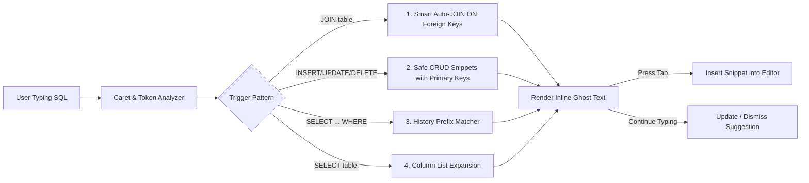

# SQL Ghost Text Auto-completion Specification & Design Guide

## 1. Overview
The **SQL Ghost Text Auto-completion Engine** provides instantaneous, zero-latency inline suggestions directly inside TableNova's Monaco SQL editor. Suggestions appear as subtle gray inline ghost text as the user types, and can be accepted with a single `Tab` key press (similar to GitHub Copilot / Cursor).

---

## 2. Core Pillars & Design Principles

### 2.1. 100% Offline & Zero-Latency (< 5ms)
- **Local Schema & Heuristics First**: Operates directly against in-memory catalog metadata (`catalog.ts`, `joinConditions.ts`, `sqlHistory.ts`).
- **No Remote AI Latency**: Generates suggestions synchronously without waiting for network round-trips or incurring API costs.
- **Privacy & Security**: Zero database credentials or schema structures leave the user's workstation.

### 2.2. Intelligent Heuristic Rules

#### Rule 1: Smart Auto-JOIN on Foreign Keys
- **Trigger**: Caret immediately follows `... JOIN <table_name> ` or `... JOIN <table_name> ON `.
- **Behavior**: Scans previously referenced tables in the query (`collectTableRefs`), checks foreign key relationships in `catalog.ts`, and suggests the exact matching condition.
- **Example**:
  - Typed: `SELECT * FROM orders JOIN users `
  - Ghost Text: `ON orders.user_id = users.id`

#### Rule 2: Safe CRUD Templates
- **INSERT INTO**:
  - Typed: `INSERT INTO users `
  - Ghost Text: `(name, email, status) VALUES ()` (Excludes auto-increment / generated primary keys).
- **UPDATE (Safe Mode Guard)**:
  - Typed: `UPDATE users `
  - Ghost Text: `SET ... WHERE id = ` (Automatically includes primary key in WHERE clause to prevent accidental full-table updates).
- **DELETE FROM (Safe Mode Guard)**:
  - Typed: `DELETE FROM users `
  - Ghost Text: `WHERE id = `

#### Rule 3: Query History Pattern Matching
- Matches current typing prefixes against successful recent queries from `sqlHistory`.
- Suggests common WHERE clauses and filter parameters previously executed by the user.

#### Rule 4: Column Expansion
- Typed: `SELECT u.` -> Suggests comma-separated list of table columns: `id, name, email, created_at`.

---

## 3. Monaco Editor Integration

### 3.1. InlineCompletionsProvider
Registered via `monaco.languages.registerInlineCompletionsProvider` for:
- `LanguageIdEnum.PG` (PostgreSQL)
- `LanguageIdEnum.MYSQL` (MySQL)
- `LanguageIdEnum.GENERIC` (SQLite & Generic SQL)

### 3.2. Settings & Preferences
Configurable in User Preferences:
- `enableGhostText: boolean` (Default: `true`)
- `ghostTextMode: 'local' | 'hybrid' | 'ai'` (Default: `'local'`)
- `ghostTextDelayMs: number` (Default: `0`)
